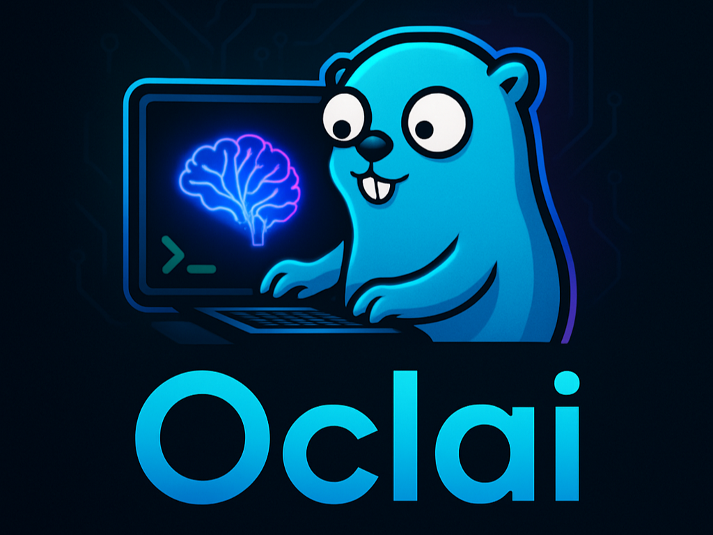

# Oclai

> An AI powered terminal assistant similar to Claude Code and Gemini CLI, but runs entirely offline using local models. No API keys, no subscriptions, no data leaving your machine.



## Why Oclai?

While tools like Claude Code and Gemini CLI have set the standard for AI-powered terminal experiences, they require cloud connectivity and API costs. **Oclai** brings similar capabilities directly to your terminal with a key difference: it's completely **offline**, **free**, and runs on **local AI models**.

Built with Go (because let's face it, Go is perfect for CLI tools), Oclai offers a refreshingly simple, non-bloated alternative that respects your privacy and doesn't require an internet connection or subscription.

### Inspiration

The AI development ecosystem has largely been dominated by Python and TypeScript/JavaScript implementations. Even industry-leading tools like Claude Code and Gemini CLI are built with TypeScript. As someone who appreciates Go's elegance and performance for building CLI applications, I wanted to shift the momentum—even if just a little—toward Go-based AI tooling. This project is my contribution to that effort.

## Features

### 🚀 Simple & Fast

- Lightweight CLI built with Go for blazing-fast performance
- Minimal dependencies and straightforward installation
- No bloat, just the features you need

### 💬 Flexible Interaction Modes

**Quick Query Mode**

```bash
oclai q "Explain how goroutines work"
```

- One-off queries to your AI model
- File-aware: Reference files in your query, and Oclai automatically reads and includes their content for context-aware responses

```bash
oclai q "Review this code for improvements" -f main.go
cat /path/file.txt | oclai q "Summerize this file"
```

**Interactive Chat Mode**

```bash
oclai chat
```

- Start a continuous conversation with your AI model
- Switch models mid-conversation
- Maintain context throughout your session

### 🔌 MCP Server Management

Oclai integrates with the [Model Context Protocol (MCP)](https://modelcontextprotocol.io/) using Anthropic's official Go MCP library, allowing your AI models to interact with external tools and services.

**Default MCP Servers Included:**

- **Filesystem**: Securely perform file operations with configurable access controls
- **Sequential Thinking**: Enable dynamic, reflective problem-solving through thought sequences
- **Fetch**: Retrieve web content using URLs

**Manage Your Servers:**

```bash
oclai mcp add    # Add new MCP servers
oclai mcp remove # Remove configured servers
oclai mcp list   # View all configured servers
```

### ⚙️ Configuration & Customization

- **Model Selection**: Set a default model or switch between models during chat sessions
- **Custom Ollama Instance**: Configure a custom baseURL if you're running Ollama on a remote server
- **Context Control**: Adjust context limits for your models
- **Service Monitoring**: Check Ollama service status with `oclai status`

### 📦 Cross-Platform Distribution

Built with [GoReleaser](https://goreleaser.com/) for automated, reliable releases across:

- **macOS** (Darwin)
- **Linux**
- **Windows**

## Installation

### Prerequisites

Before installing Oclai, ensure you have:

1. **Ollama** - [Install Ollama](https://ollama.ai/download)
2. **npx** (Node.js) - [Install Node.js](https://nodejs.org/) (for MCP servers)
3. **Docker** - [Install Docker](https://docs.docker.com/get-docker/) (for MCP servers)

### Install Oclai

#### macOS

```bash
brew tap thejasmeetsingh/oclai https://github.com/thejasmeetsingh/oclai
brew install --cask oclai # or: brew install oclai
```

#### Linux

```bash
wget https://github.com/thejasmeetsingh/oclai/releases/download/v0.1.0/oclai_0.1.0_linux_x86_64.deb
sudo dpkg -i oclai_0.1.0_linux_x86_64.deb
```

#### Windows

```bash
scoop bucket add thejasmeetsingh https://github.com/thejasmeetsingh/oclai
scoop install thejasmeetsingh/oclai
```

## Usage

Once installed, run `oclai` to see all available commands and options:

```bash
oclai
```

### Quick Start Examples

**Ask a quick question:**

```bash
oclai q "Tell me about the roman empire"
```

**Start an interactive chat:**

```bash
oclai chat
```

**Check available models:**

```bash
oclai models
```

**Get help on any command:**

```bash
oclai [command] --help
```

### Available Commands

| Command      | Aliases | Description                                |
| ------------ | ------- | ------------------------------------------ |
| `chat`       | `ch`    | Start an interactive chat session          |
| `completion` | -       | Generate shell autocompletion scripts      |
| `help`       | -       | Get help for any command                   |
| `mcp`        | -       | Manage MCP servers (see subcommands below) |
| `models`     | -       | List available models                      |
| `query`      | `q`     | Ask a query to the model                   |
| `status`     | -       | Check Ollama service status                |

#### MCP Subcommands

**Add a new MCP server:**

```bash
oclai mcp add [flags]
```

Available flags:

- `--args <string>` - Arguments for the server command
- `--cmd <string>` - Command to start the server
- `--endpoint <string>` - HTTP/SSE endpoint of the server
- `--env <strings>` - Specify environment variables (comma-separated) to run the server command with
- `--headers <strings>` - Add additional headers (comma-separated) for server connection
- `-n, --name <string>` - Server name (required)

**List configured MCP servers:**

```bash
oclai mcp list  # or: oclai mcp ls
```

**Remove an MCP server:**

```bash
oclai mcp remove [name]  # or: oclai mcp rm [name]
```

### Global Flags

These flags can be used with any command:

| Flag                | Description           |
| ------------------- | --------------------- |
| `--baseURL <value>` | Set Ollama base URL   |
| `--ctx <value>`     | Set context limit     |
| `-h, --help`        | Show help information |
| `--model <value>`   | Set default model     |

## Demo

_Coming soon! A video demonstration of Oclai's features will be added here._

## Known Limitations

- **No Streaming Responses**: Currently, Oclai doesn't support streaming model responses.

- **Local Model Performance**: Since Oclai uses local models via Ollama, the intelligence and capabilities are constrained by the model you choose and your hardware. While these models can't match the power of proprietary models from larger companies, they're highly capable—especially with good hardware and effective prompting—and offer the benefits of privacy and zero API costs.

## Contributing

While this project isn't actively seeking contributions, pull requests are welcome! If you find a bug or have a feature suggestion, feel free to open an issue.

## License

This project is licensed under the MIT License - see the [LICENSE](./LICENSE) file for details.

## Support

If you encounter issues or have questions:

- Check the built-in help: `oclai --help` or `oclai [command] --help`
- Open an issue on [GitHub](https://github.com/thejasmeetsingh/oclai/issues)

---

**Built with ❤️ and Go**
